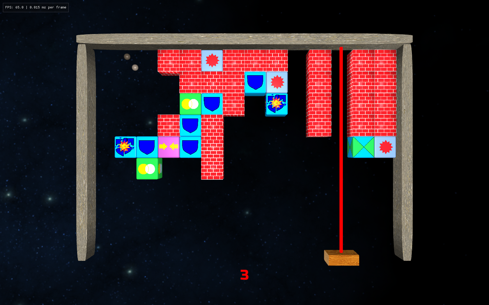
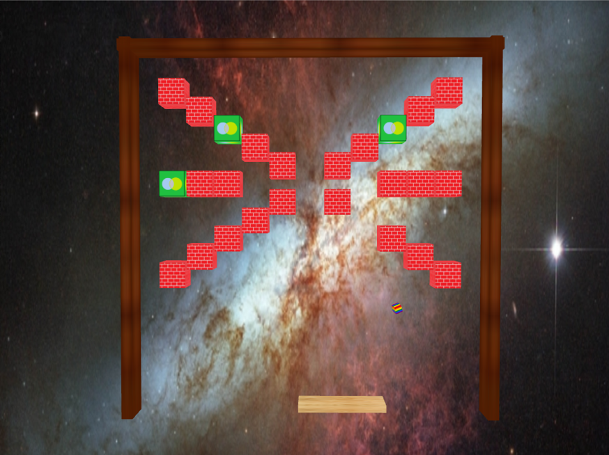

# BrickBreak-2.5D

BrickBreak 2.5D is a game based on the classic WinBrick.

I made the original version of this game back in my student years but, this time, it was redone with a more modern OpenGL 3.3 renderer based on tutorials by [Victor Gordan](https://www.youtube.com/@VictorGordan) and [learnopengl.com](https://learnopengl.com/). It now has sound and music and every 3D asset was made from scratch in Blender (all brick textures are the originals and were made in glorious MS Paint). Additionally, the player is given three level slots to edit and create their own brick layout, and design each level however they wish.

The game runs on Windows 10 or higher PCs (haven't tested older versions of Windows) and you can download it in the Releases section of this repository. Full instructions and credits are given with the actual software.

Thanks for checking this out.

Here's a picture of the original.

